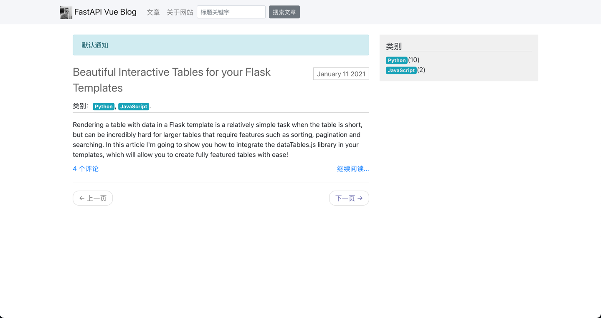
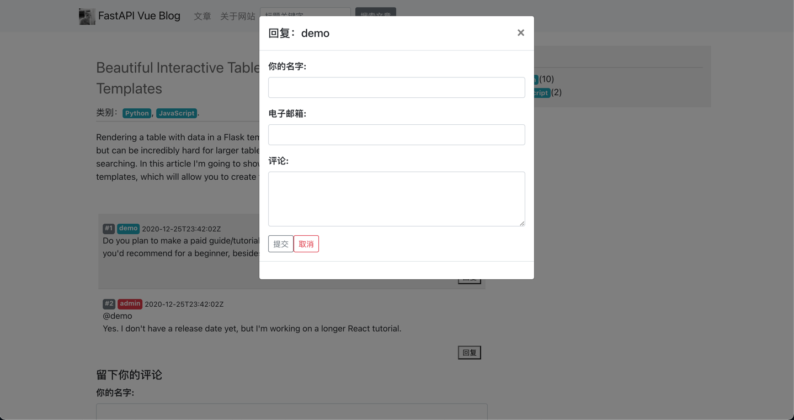
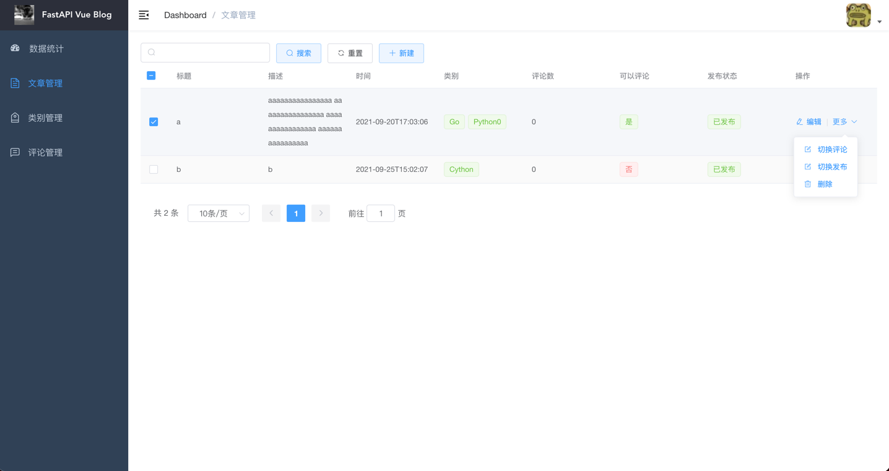
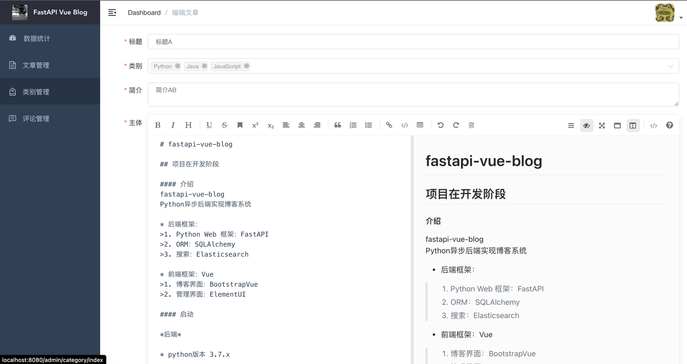
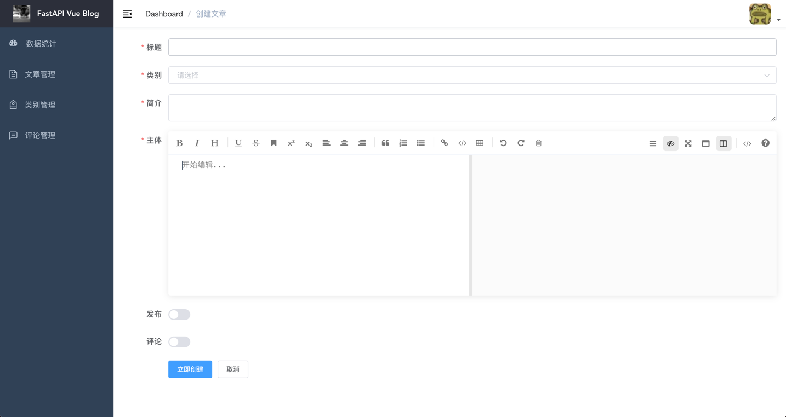
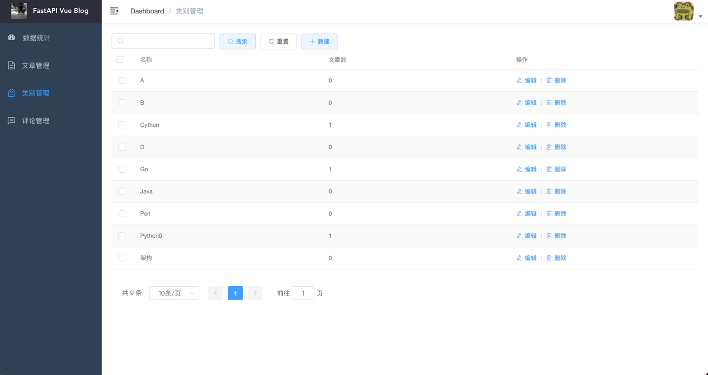
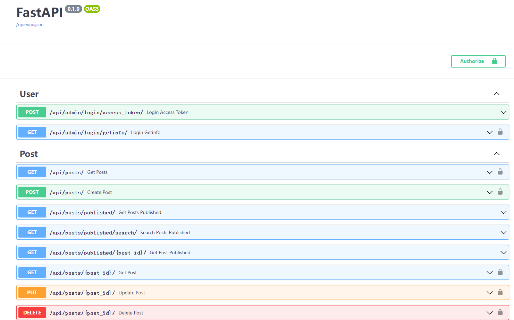

# fastapi-vue-blog

## 项目在开发阶段

#### 介绍
fastapi-vue-blog
Python异步后端实现博客系统

* 后端框架：
>1. Python Web 框架：FastAPI
>2. 数据库：MySQL
>3. ORM：SQLAlchemy
>4. 搜索：Elasticsearch (未集成)

* 前端框架：Vue
>1. 博客界面：BootstrapVue
>2. 管理界面：ElementUI

#### 启动 

*后端*

* Python版本 3.7.x (建议使用虚拟环境)
* MySQL版本 5.7.x

+ 后端配置数据库和账号密码
>1. 在fastapi-vue-blog/webapi目录下
>2. 修改setting文件

+ 初始化和启动
>1. 在fastapi-vue-blog/webapi目录下
>2. pip install -r requirements.txt
>3. 如果需要初始化数据库 python db/init_db.py
>4. python app.py

*前端*

* Node版本: 12.13.x
* 安装好Node和vue-cli

>1.  在fastapi-vue-blog/webapi目录下
>2.  安装依赖: npm install
>3.  启动开发: npm run dev

#### 功能

*游客*

>1. 可以看到所有文章
>2. 可以看到所有类别
>3. 可以根据分类筛选文章列表
>4. 在文章中可以看到评论
>5. 全文高亮搜索

*管理员*

>1. 数据统计
>2. 文章管理
>3. 类别管理
>4. 评论管理

#### 插图

