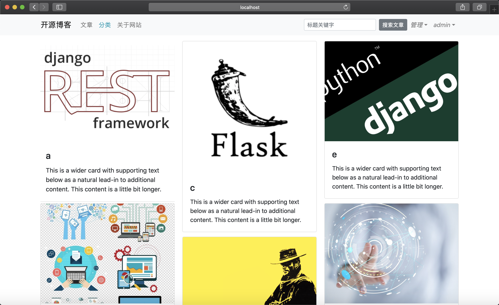
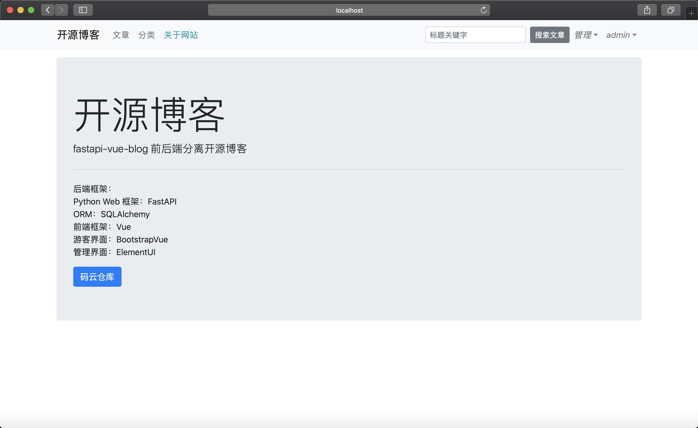
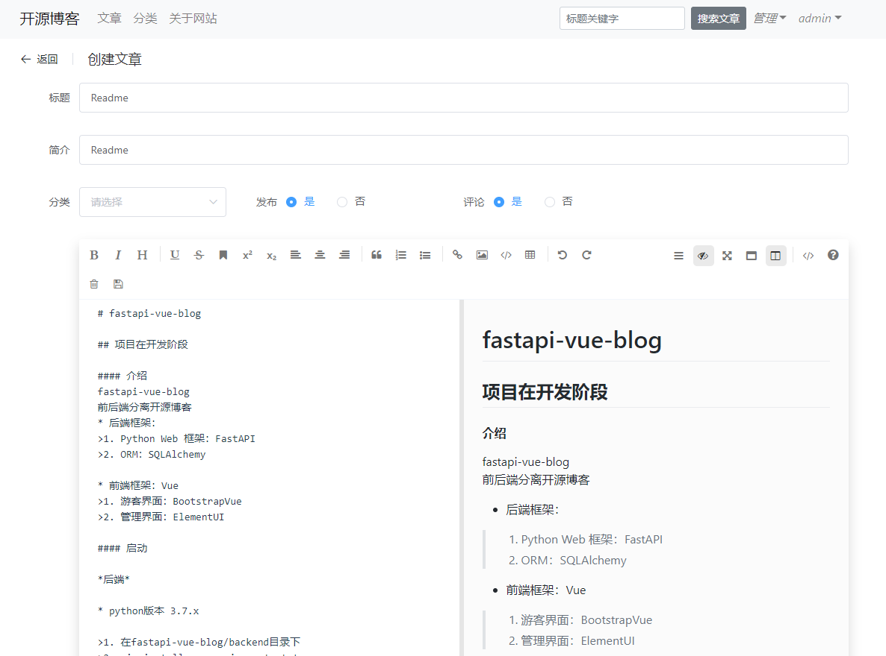
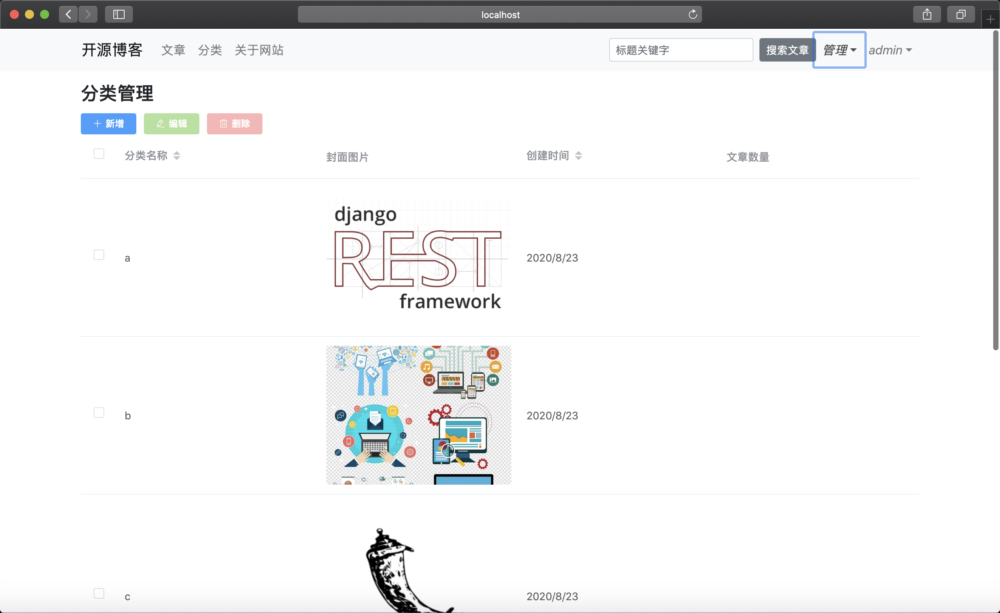

# fastapi-vue-blog

## 项目在开发阶段

#### 介绍
fastapi-vue-blog
前后端分离开源博客
* 后端框架：
>1. Python Web 框架：FastAPI
>2. ORM：SQLAlchemy

* 前端框架：Vue
>1. 游客界面：BootstrapVue
>2. 管理界面：ElementUI

#### 启动 

*后端*

* python版本 3.7.x

>1. 在fastapi-vue-blog/backend目录下
>2. pip install -r requirements.txt
>3. python main.py
>4. 数据库迁移https://www.cnblogs.com/turingbrain/p/6372086.html

*前端*

* node版本: 12.13.x
* 安装好node和vue-cli

>1.  在fastapi-vue-blog/frontend目录下
>2.  安装依赖: npm install
>3.  启动开发: npm run dev
>4.  打包命令: npm run build 

#### 功能

*游客*

>1. 可以看到所有文章
>2. 可以看到所有分类
>3. 可以根据分类筛选文章列表
>4. 在文章中可以看到评论
>5. *可以根据关键词搜索文章

*管理员*

>1. 文章管理
>2. 分类管理
>3. 评论管理
>4. 使用MarkDown编写文章

#### 前端URL

##### 游客

*首页*

* /posts?page=1&limit=10 显示所有文章›
* /post?category=python 分类文章显示
* /posts/<post_id: int> 文章详细

*分类*

* /categories 显示所有分类

##### 管理员

* /manage/posts       文章管理
* /manage/post?       文章编辑/创建
* /manage/categories  分类管理
* /manage/category?   分类编辑/创建
* /manage/comments    评论管理
* /manage/comment     评论编辑

#### 后端API

*文章*

* GET /api/v1/posts/?category=python&page=1&limit=10 显示所有文章 分类文章显示
* POST /api/v1/posts/                 创建文章
* GET /api/v1/posts/<int: post_id>    获取单个文章
* PUT /api/v1/posts/<int: post_id>    修改文章
* DELETE /api/v1/posts/<int: post_id> 删除文章

*评论*

* GET     /api/v1/comments/? 所有评论
* POST    /api/v1/comments/ 创建评论
* DELETE  /api/v1/comments/ 删除评论
* GET     /api/v1/comments/<int: comment_id> 获取单个
* PUT     /api/v1/comments/<int: comment_id> 编辑单个评论

*分类*

* GET     /api/v1/categories/ 所有分类
* POST    /api/v1/categories/ 添加分类

*登录*

* GET /api/v1/login/access-token 登录获取token

#### 插图

